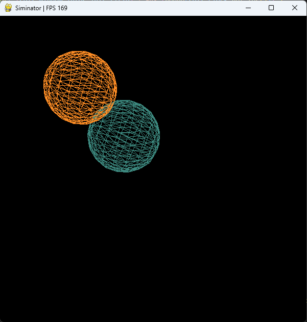

Simulador físico conceitual feito em Python

<!--  -->


## Como usar

Versões do Python suportadas: >=3.11

Siga os passos em:

1. <a href="#ambiente-virtual-e-configurações-básicas">Ambiente virtual e Configurações Básicas</a>
2. <a href="#instalação-e-execução">Instalação e Execução</a>
3. <a href="#utilizando-inatorengine">Utilizando InatorEngine</a>

### Ambiente virtual e Configurações Básicas

Clone o repositório e entre na pasta:
```bash
git clone https://github.com/ffernandoalves/siminator
cd siminator
```

Crie um ambiente virtual:

```bash
$ python3 -m venv env                           # Crie um ambiente virtual python
```

Ative o ambiente virtual com base no seu sistema operacional:

```bash
$ source env/bin/activate                       # no Linux
$ .\env\Scripts\activate                        # no Windows
$ python -m pip install --upgrade pip           # Atualize o pip
```

### Instalação e Execução

```bash
$ pip install -U build
$ python -m build --sdist                       # Irá gera o pacote do codigo cpython na pasta `dist`
$ python -m pip install .\dist\siminator-0.0.1.tar.gz # Instale ele no ambiente virtual
```

E execute (teste):

```bash
$ python inator.py
```

### Utilizando InatorEngine
Crie o seu próprio modelo utilizando `InatorEngine`

```python
# my_inator.py

import pygame
import siminator as si

# Colors
WHITE = (255, 255, 255)

# Callbacks
def quit(self: si.InatorEngine):
    """custom exit"""
    if self.pg_event.type == pygame.KEYDOWN:
        if self.pg_event.key == pygame.K_ESCAPE:
            self.running = False


class MyInator(si.InatorEngine):
    def start(self):
        self.camera = si.Camera(si.Vector3([0, 0, 20]), self.window, 700)
        ellipsoid = si.Ellipsoid(si.Vector3([0, 0, 15]), WHITE, self.camera)
        self.add_models([ellipsoid])
        self.add_callback((quit, self))


if __name__ == "__main__":
    screen_info = si.ScreenInfo(600, 600, "Siminator", "#DCDDD8")
    MyInator(screen_info).run()
```

Salve e execute:

```bash
$ python my_inator.py
```

## Dev

### Testes

Teste o pacote usando pytest e tox

```bash
$ python -m pip install -U tox  # instale o tox no ambiente virtual
$ tox                           # execute os testes
```